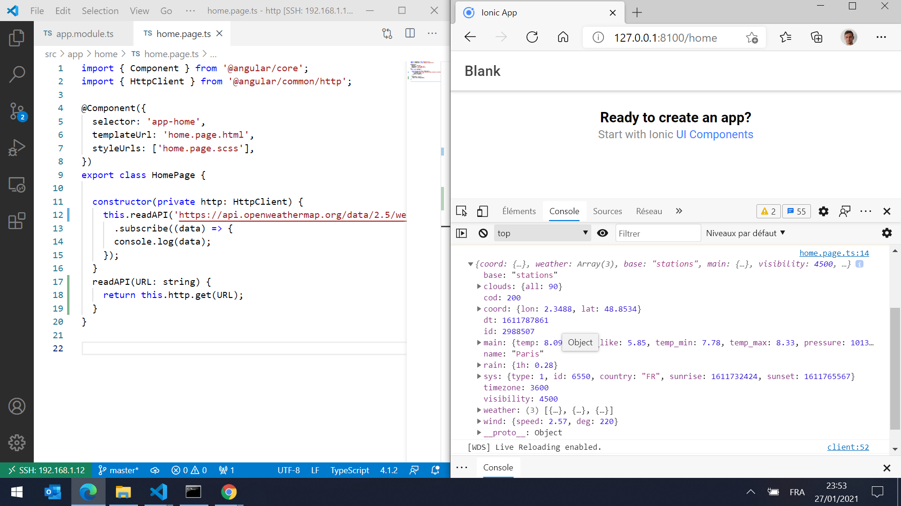
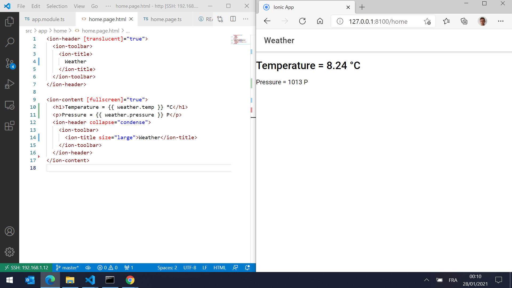
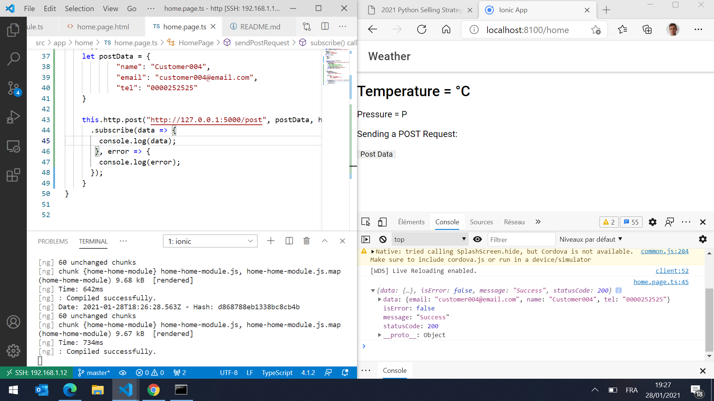

# HTTP Ionic App

https://drissas.com/ionic-http/

Based on `blank` ionic starter template:
`ionic start`

## First step

modify `src/app/app.module.ts`

```typescript
import { HttpClientModule } from  '@angular/common/http';

[..]

imports: [
  IonicModule.forRoot(),
  HttpClientModule <-- ADD THIS MODULE
],
```


## Second step

modify `src/app/home/home.page.ts`

```typescript
import { HttpClient } from '@angular/common/http';

[..]

constructor(private http: HttpClient) {
  weather =
  {
      temp:''
  };

  this.readAPI('https://api.openweathermap.org/data/2.5/weather?q=Paris,France&apikey={API key}')
    .subscribe((data) => {
    console.log(data);
    this.weather.temp = data['main']['temp']
  });
}
```



## Third step

Add a POST request
`src/app/home/home.page.ts`

```typescript

import { HttpClient,HttpHeaders } from '@angular/common/http';

[..]

  sendPostRequest() {
    const httpOptions = {
      headers: new HttpHeaders({
        'Content-Type':  'application/json'
        })
      };
    let postData = {
            "name": "Customer004",
            "email": "customer004@email.com",
            "tel": "0000252525"
    }

    this.http.post("http://127.0.0.1:5000/post", postData, httpOptions)
      .subscribe(data => {
        console.log(data);
       }, error => {
        console.log(error);
      });
  }
```

Include a button to trigger the call
`src/app/home/home.page.html`

```html
  <p>
    Sending a POST Request:
  </p>
  <button ion-button (click)="sendPostRequest()">Post Data</button>
```

Set up a Flask server running on another port (by default 5000) to receive a POST request:

```python
from flask import Flask, request, jsonify
import json
app = Flask(__name__)

@app.route('/post',methods=['POST'])
def post():
    data = request.data
    jsonData = json.loads(data)
    print(jsonData)
    return jsonify(isError= False,
                    message= "Success",
                    statusCode= 200, data=jsonData), 200

if __name__ == '__main__':
    app.run()
```

Run the server
```
set FLASK_APP=app.py
set FLASK_ENV=development
flask run
```



## OpenWeatherMap API doc
https://openweathermap.org/current

## Ionic doc 
https://ionicframework.com/docs/native/http

## More resources
https://medium.com/@aashimad1/calling-an-api-or-making-http-requests-in-ionic-bc0b58252014
https://www.techiediaries.com/ionic-http-post/
https://www.freakyjolly.com/ionic-native-http-plugin-tutorial-with-example/amp/